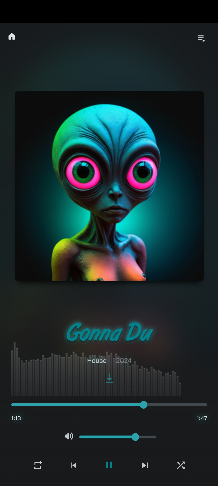
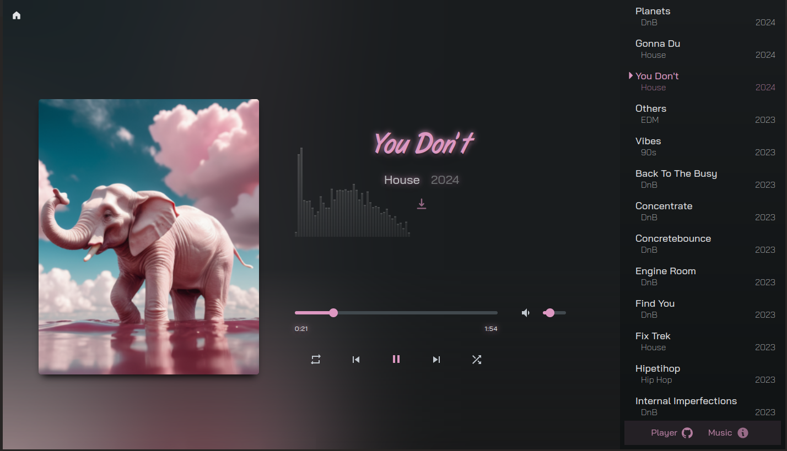

<div align="center">
<h1><a href="https://music.stian.fan">music.stian.fan</a>
<br>🎵 Web Music Player</h1>
<p>
A modern, feature-rich web music player built with HTML, CSS, and JavaScript. <br>
This project showcases custom music with an immersive user interface and dynamic audio visualization. <br>
Live at <a href="https://music.stian.fan">music.stian.fan</a>
</p>


</div>

## ✨ Features

- 🎨 **Dynamic Theme Colors**: Automatically adapts the UI colors based on the current album artwork
- 📊 **Real-time Audio Visualizer**: Built using the WebAudio API for an engaging visual experience
- 📱 **Responsive Design**: Seamlessly works across desktop, tablet, and mobile devices
- ⬇️ **Easy Downloads**: Download songs directly by clicking the artist name
- 🎮 **Full Playback Controls**: 
  - Play/Pause
  - Next/Previous Track
  - Shuffle Mode
  - Repeat Mode
  - Volume Control
  - Seek Functionality
- 📑 **Playlist Management**: Easy access to the full music library
- 🌈 **Visual Feedback**: Smooth animations and transitions for an enhanced user experience

## 🚀 Getting Started

1. Clone the repository:
```bash
git clone https://github.com/stianfan/music.stian.fan.git
```

2. Open `index.html` in your web browser

That's it! No build process or dependencies required.

## 🛠️ Technology Stack

- HTML5
- CSS3
- Vanilla JavaScript
- Web Audio API
- Canvas API

## 🙏 Credits

This project is based on:
- [Music Player by codewithsadee](https://github.com/codewithsadee/music-player)
- [HTML5 Audio Visualizer by wayou](https://github.com/wayou/HTML5_Audio_Visualizer)

Special thanks to the original creators for their inspiring work.

## 📝 License

Feel free to use this player and the included tracks in your creative projects. While not required, credit to stian.fan is appreciated when using the music.

-[stian.fan](http://stian.fan)
